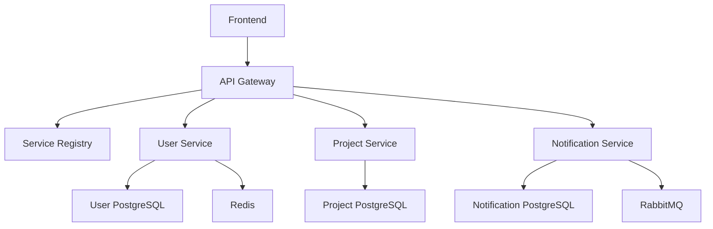

# ScholarAI Platform Architecture Documentation

## Overview

ScholarAI is a comprehensive AI-powered research platform built using a **Meta Repository Architecture** with Git submodules for modular development. The platform integrates multiple microservices, AI services, and frontend components to provide a seamless research experience.

---

## 🏗️ Architecture Design

### Meta Repository Structure

The platform follows a **Git submodules architecture** managed through the `meta` repository:

```
meta/
├── Frontend/                    # → frontend submodule (Next.js)
├── Microservices/
│   ├── api-gateway/            # → API Gateway submodule
│   ├── user-service/           # → User Service submodule  
│   ├── project-service/        # → Project Service submodule
│   ├── notification-service/   # → Notification Service submodule
│   └── service-registry/       # → Service Registry submodule
├── Docker/                     # Docker orchestration
├── Scripts/                    # Platform management scripts
└── .gitmodules                 # Submodule definitions
```

### Independent Repositories

Each component is maintained as an independent repository:

| Repository | Technology | Purpose | Port |
|:---|:---|:---|:---:|
| [`meta`](https://github.com/meta) | Shell/Docker | Orchestration & deployment | - |
| [`frontend`](https://github.com/frontend) | Next.js 14+ | User interface | 3000 |
| [`api_gateway`](https://github.com/api_gateway) | Spring Cloud | Request routing | 8989 |
| [`user_service`](https://github.com/user_service) | Spring Boot | Authentication | 8081 |
| [`project_service`](https://github.com/project_service) | Spring Boot | Project management | 8083 |
| [`notification_service`](https://github.com/notification_service) | Spring Boot | Notifications | 8082 |
| [`service_registry`](https://github.com/service_registry) | Eureka | Service discovery | 8761 |
| [`docs`](https://github.com/docs) | Markdown | Documentation | - |

### AI Services (Integration Ready)

Two additional repositories are being integrated:

| Repository | Technology | Purpose | Port |
|:---|:---|:---|:---:|
| `extractor` | FastAPI/Python | PDF content extraction | 8084 |
| `paper-search` | FastAPI/Python | Academic search | 8085 |

---

## 🔧 Technology Stack

### Backend Microservices
- **Framework**: Spring Boot 3.5.0
- **Language**: Java 21
- **Build Tool**: Maven
- **Service Discovery**: Eureka
- **API Gateway**: Spring Cloud Gateway
- **Security**: Spring Security + JWT
- **Database**: PostgreSQL 17 (per-service)
- **Caching**: Redis
- **Messaging**: RabbitMQ

### Frontend Application
- **Framework**: Next.js 14+
- **Language**: TypeScript 5.0+
- **Styling**: Tailwind CSS
- **UI Components**: Radix UI
- **Authentication**: JWT + OAuth2
- **State Management**: React Context
- **API Integration**: Fetch API

### AI Services
- **Framework**: FastAPI
- **Language**: Python 3.11+
- **ML Libraries**: PyTorch, Transformers
- **PDF Processing**: GROBID, PDFFigures2, Nougat
- **OCR**: Tesseract, EasyOCR, PaddleOCR
- **Computer Vision**: OpenCV
- **Message Queue**: RabbitMQ (pika)

### Infrastructure
- **Containerization**: Docker + Docker Compose
- **Cloud Storage**: Backblaze B2
- **Database**: PostgreSQL 17 Alpine
- **Cache**: Redis Alpine
- **Message Broker**: RabbitMQ Management
- **Service Mesh**: Spring Cloud Eureka

---

## 🚀 Deployment Architecture

### Docker Compose Orchestration

The platform uses a multi-compose file strategy:

#### Infrastructure Services (`services.yml`)
```yaml
services:
  user-postgres:      # User service database
  project-postgres:   # Project service database  
  notification-postgres: # Notification service database
  redis:             # Caching layer
  rabbitmq:          # Message broker
```

#### Application Services (`apps.yml`)
```yaml
services:
  service-registry:  # Eureka (Port 8761)
  api-gateway:       # Gateway (Port 8989)
  user-service:      # Auth (Port 8081)
  project-service:   # Projects (Port 8083)
  notification-service: # Notifications (Port 8082)
  frontend:          # UI (Port 3000)
```

### Service Dependencies



---

## 🔌 API Architecture

### Gateway Routing

All external requests route through the API Gateway:

```
Client → API Gateway (8989) → Microservice (8081-8083)
```

### Service Discovery

Services register with Eureka for dynamic discovery:

```
Service → Eureka Registration → Gateway Route Updates
```

### Authentication Flow

JWT-based authentication with refresh tokens:

```
Login → JWT + Refresh Token → Protected Requests → Token Refresh
```

---

## 📊 Data Architecture

### Database-per-Service Pattern

Each microservice maintains its own database:

- **User Service**: `userDB` - User accounts, profiles, authentication
- **Project Service**: `projectDB` - Research projects, collaboration
- **Notification Service**: `notificationDB` - Alerts, messages, preferences

### Shared Infrastructure

- **Redis**: Session storage, caching
- **RabbitMQ**: Inter-service messaging
- **Backblaze B2**: File storage

---

## 🔄 Message Queue Architecture

### RabbitMQ Integration

Asynchronous processing for:
- Email notifications
- PDF processing requests
- Search result caching
- Background task execution

### Queue Structure
```
Producer → Exchange → Queue → Consumer → Processing
```

---

## 🛡️ Security Architecture

### Authentication & Authorization
- **JWT Access Tokens** (15-minute expiry)
- **Refresh Tokens** (7-day expiry, HttpOnly cookies)
- **OAuth2 Integration** (Google, GitHub)
- **Role-based Access Control** (USER, ADMIN)

### Service Security
- **Service-to-service** communication via Eureka
- **API Gateway** enforces authentication
- **CORS configuration** for cross-origin requests
- **Security headers** implementation

---

## 📈 Scalability Design

### Horizontal Scaling
- **Stateless services** for easy scaling
- **Load balancing** via API Gateway
- **Database per service** for independent scaling
- **Container orchestration** ready

### Performance Optimization
- **Redis caching** for frequent queries
- **Database connection pooling**
- **Asynchronous processing** with message queues
- **Static asset optimization** in frontend

---

## 🔮 Future Integration Points

### AI Service Expansion
- **Writing Assistant Service** - LaTeX editing support
- **Review Agent Service** - Academic paper review
- **Citation Service** - Reference management
- **Analytics Service** - Research impact tracking

### External Integrations
- **Academic APIs**: Semantic Scholar, arXiv, PubMed
- **Storage Services**: AWS S3, Google Drive
- **Identity Providers**: ORCID, institutional SSO
- **Version Control**: Git integration for papers

---

## 📋 Development Workflow

### Repository Management
```bash
# Clone with submodules
git clone --recurse-submodules https://github.com/meta.git

# Update all submodules
git submodule update --remote --merge

# Add new submodule
git submodule add <repo-url> <path>
```

### Platform Management
```bash
# Start entire platform
./Scripts/docker.sh start-all

# Start specific service
./Scripts/docker.sh start user-service

# View service logs
./Scripts/docker.sh logs frontend

# Stop all services
./Scripts/docker.sh stop-all
```

---

## 🎯 Architecture Benefits

### Development Benefits
- **Independent development** of each service
- **Technology diversity** (Java, TypeScript, Python)
- **Team specialization** on specific components
- **Isolated testing** and deployment

### Operational Benefits
- **Service isolation** prevents cascading failures
- **Independent scaling** based on demand
- **Technology upgrades** without platform-wide changes
- **Monitoring granularity** per service

### Business Benefits
- **Faster feature development** through parallel work
- **Easier maintenance** with focused codebases
- **Better fault tolerance** with service isolation
- **Cost optimization** through selective scaling

---

## 📚 Documentation Structure

This architecture supports comprehensive documentation across:

- **API Documentation** - Per-service API specs
- **Use Case Documentation** - User journey mapping
- **Schema Documentation** - Database and DTO definitions
- **Integration Guides** - Service interaction patterns
- **Deployment Guides** - Environment setup instructions

---

*This architecture document reflects the current state of ScholarAI platform as of August 2025, with integration points ready for the extractor and paper-search services.*
